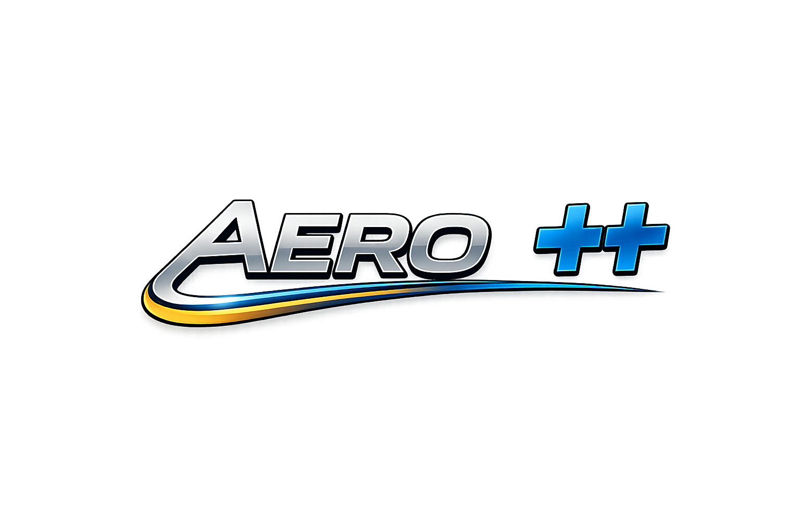

<p align="center">
  
</p>

<h1 align="center">AERO++</h1>

<p align="center">
C++ header-only API for aircraft preliminary design — aerodynamics, weight & balance, inertia, performance, statistical analysis, 3D visualization, and data export.
</p>

## Features

- Header-only library (easy integration)
- Eigen for linear algebra
- Gnuplot integration for 2D data visualization
- **VTK-based 3D aircraft visualization** — interactive rendering and multi-view PNG export
- **Per-component color mapping** — assign colors to each aircraft component by name
- OpenVSP DegenGeom CSV parser
- OpenCASCADE integration for STEP/IGES geometry import
- Cross-platform support (Linux, macOS, Windows)

## Documentation

Full API documentation is available at:
**<a href="https://am3software.github.io/AEROPlusPlus/GuideAEROPlusPlus.html" target="_blank">AERO++ Documentation</a>**

## Dependencies

| Dependency | Required | Purpose |
|------------|----------|---------|
| **Git** | Required | Clone AERO++ and vendored OpenXLSX |
| **GCC / G++ MinGW64** | Required | C/C++ compilation |
| **CMake + Ninja** | Required | Configure and build the project |
| **Boost** | Required | gnuplot-iostream plotting and utility libraries |
| **Eigen3** | Required via MSYS2 | Linear algebra include path |
| **tinyxml2** | Required via MSYS2 | XML parsing |
| **libzip** | Required | OpenXLSX ZIP backend; avoids MinGW/miniz FetchContent issues |
| **OpenXLSX** | Vendored | Excel file I/O; pinned to commit `5723411d47643ce3b5b9994064c26ca8cd841f13` |
| **gnuplot** | Recommended | 2D data visualization |
| **VTK** | Recommended | 3D aircraft visualization |
| **Python3** | Recommended | Build integration / scripting support |
| **OpenCASCADE** | Optional | STEP/IGES geometry import |
| **GDB** | Recommended | Debugging from MSYS2 or VS Code |

> On Windows/MSYS2, OpenXLSX is intentionally vendored in `third_party/OpenXLSX` instead of being downloaded by CMake FetchContent. This makes the student installation reproducible and avoids repeated network/tag/miniz issues.

---

## Installation

### Linux (Ubuntu/Debian)

```bash
sudo apt-get update
sudo apt-get install build-essential cmake libboost-all-dev gnuplot libvtk9-dev
```

### macOS

```bash
brew install cmake boost gnuplot vtk
```

### Windows (MSYS2 — Recommended and tested)

The validated Windows workflow is based on **MSYS2 MinGW64**. For best reliability, clone and build the repository inside the MSYS2 home directory:

```text
C:\msys64\home\<your-user>\AEROPlusPlus
```

In the MSYS2 MinGW64 terminal this is:

```bash
~/AEROPlusPlus
```

> **Important:** do not clone/build the project under `C:\Users\...\Documents` for the student workflow. Building under the MSYS2 home directory avoids Windows permission issues, incomplete CMake cache generation, and runtime-folder copy problems observed during installation tests.

1. **Download and install MSYS2** from [msys2.org](https://www.msys2.org/).

2. Open **MSYS2 MinGW 64-bit** and update the system:

```bash
pacman -Syu
```

If MSYS2 asks you to close the terminal, close it, reopen **MSYS2 MinGW 64-bit**, and run again:

```bash
pacman -Syu
```

3. Install the base toolchain and AERO++ dependencies:

```bash
pacman -S --needed \
  git \
  mingw-w64-x86_64-gcc \
  mingw-w64-x86_64-cmake \
  mingw-w64-x86_64-ninja \
  mingw-w64-x86_64-boost \
  mingw-w64-x86_64-eigen3 \
  mingw-w64-x86_64-tinyxml2 \
  mingw-w64-x86_64-libzip \
  mingw-w64-x86_64-gnuplot \
  mingw-w64-x86_64-gdb \
  mingw-w64-x86_64-python
```

4. Install VTK and the dependency targets commonly required by MSYS2 VTK:

```bash
pacman -S --needed \
  mingw-w64-x86_64-vtk \
  mingw-w64-x86_64-nlohmann-json \
  mingw-w64-x86_64-fast_float \
  mingw-w64-x86_64-utf8cpp \
  mingw-w64-x86_64-cli11 \
  mingw-w64-x86_64-openvr \
  mingw-w64-x86_64-hdf5 \
  mingw-w64-x86_64-netcdf \
  mingw-w64-x86_64-libogg \
  mingw-w64-x86_64-libtheora \
  mingw-w64-x86_64-cgns \
  mingw-w64-x86_64-gl2ps \
  mingw-w64-x86_64-proj \
  mingw-w64-x86_64-qt6-declarative \
  mingw-w64-x86_64-openslide \
  mingw-w64-x86_64-adios2
```

5. Optional STEP/IGES support:

```bash
pacman -S --needed mingw-w64-x86_64-opencascade
```

6. Verify the installation:

```bash
git --version
g++ --version
cmake --version
ninja --version
gnuplot --version
gdb --version
python --version
```

> **Important:** always use the **MSYS2 MinGW 64-bit** terminal, not the default MSYS2 terminal.

---

## Quick Start

### Build with CMake (Windows/MSYS2 validated workflow)

Run these commands from the **MSYS2 MinGW 64-bit** terminal.

```bash
cd ~
git clone https://github.com/Am3Software/AEROPlusPlus.git
cd AEROPlusPlus
```

Vendor the tested OpenXLSX version:

```bash
mkdir -p third_party
git clone --no-checkout https://github.com/troldal/OpenXLSX.git third_party/OpenXLSX
git -C third_party/OpenXLSX checkout 5723411d47643ce3b5b9994064c26ca8cd841f13
```

Verify that the OpenXLSX checkout is clean and at the expected commit:

```bash
git -C third_party/OpenXLSX describe --tags --always --dirty
git -C third_party/OpenXLSX rev-parse HEAD
git -C third_party/OpenXLSX status --short
```

Expected output:

```text
v0.3.2-227-g5723411
5723411d47643ce3b5b9994064c26ca8cd841f13
```

Configure and build:

```bash
rm -rf build
cmake -S . -B build -G Ninja \
  -DCMAKE_BUILD_TYPE=Debug \
  -DCMAKE_POLICY_VERSION_MINIMUM=3.5 \
  -DCMAKE_EXPORT_COMPILE_COMMANDS=ON \
  -Wno-dev

cmake --build build
```

A successful CMake configuration must end with:

```text
-- Configuring done
-- Generating done
-- Build files have been written to: .../AEROPlusPlus/build
```

Then `build/CMakeCache.txt` and `build/build.ninja` must both exist.

### Run the tests

```bash
./build/SpitFire_Test.exe
./build/TestVSPCreator.exe
./build/PowerTestPropellerAircraft.exe
```

If you want to build only one target:

```bash
cmake --build build --target SpitFire_Test
```

CMake will:
- use the vendored OpenXLSX checkout;
- use MSYS2 `tinyxml2`, `libzip`, Boost, Eigen3, Python3 and VTK;
- request only the VTK components needed by the AERO++ visualization module;
- copy runtime folders such as `AircraftSettings`, `FuselagePreset`, `NacellePreset` and `ExcelFiles` to the build directory when configured to do so.

### Custom VTK path


If VTK is installed in a non-standard location:
```bash
cmake -DVTK_DIR=/path/to/vtk/cmake ..
```

---

## 3D Visualization — AircraftPlotter

The `AircraftPlotter` class (in `include/Plotter3D.h`) translates MATLAB's `plotDegenSurf` and `PlotAircraft` into C++ using VTK.

### Basic usage

```cpp
#include "Plotter3D.h"
#include "DegenGeomParser.h"
#include <filesystem>

// Parse OpenVSP DegenGeom CSV
DegenGeomReader reader("P2012_DegenGeom.csv");
auto components = reader.read();

// Create plotter
AircraftPlotter plotter("P2012", "logo/AeroPlusPLus_logo.png");
plotter.setResolution(2560, 1440);              // 2K output
plotter.setBackground(38, 38, 38);              // dark grey background (RGB 0-255)

// Assign colors per component (RGB 0-255, matched by name prefix)
std::map<std::string, std::array<double, 3>> colorMap = {
    {"wing",       {  0,   0, 255}},
    {"horizontal", {  0, 255,   0}},
    {"vertical",   {255,   0, 255}},
    {"Fuselage",   {180, 180, 180}},
    {"nacelle",    {100, 200, 255}},
    {"disk",       { 80,  80,  80}},
};

for (const auto& surf : components)
    plotter.addComponentWithColorMap(surf, colorMap);

// Save all views + open interactive window
plotter.plotAndSave(std::filesystem::current_path().string());
```

### Available views

| Method | Description |
|--------|-------------|
| `saveAllViews(dir)` | Saves Top, Side, Front, Perspective PNG — non-blocking |
| `savePNG(file, view)` | Saves a single PNG with chosen view |
| `show(view)` | Opens interactive 3D window — blocking |
| `plotAndSave(dir)` | Saves all views then opens interactive window |

### Camera views

```cpp
CameraView::TOP         // Top-down view (X+ = nose up)
CameraView::SIDE        // Side view (nose left, tail right)
CameraView::FRONT       // Front view (nose toward observer)
CameraView::PERSPECTIVE // Perspective view (azimuth=-45, elevation=45)
```

### Setters

```cpp
plotter.setResolution(3840, 2160);          // 4K
plotter.setBackground(135, 206, 235);       // sky blue (RGB 0-255)
plotter.setOpacity(0.8);                    // semi-transparent surfaces
plotter.setLogo("logo/logo.png", 0.12, 20); // logo, size 12% of width, 20px margin
```

---

## Usage in Your Project

### Method 1: Include directly

```cpp
#include "AEROPlusPlus/include/Plotter3D.h"
#include "AEROPlusPlus/include/DegenGeomParser.h"
#include <Eigen/Dense>
```

### Method 2: CMake integration

```cmake
include_directories(/path/to/AEROPlusPlus/include)

find_package(VTK REQUIRED)
find_package(Boost COMPONENTS iostreams system filesystem REQUIRED)

add_executable(your_program your_code.cpp)
target_link_libraries(your_program ${Boost_LIBRARIES} ${VTK_LIBRARIES})
vtk_module_autoinit(TARGETS your_program MODULES ${VTK_LIBRARIES})
```

---

## Project Structure

```
AEROPlusPlus/
├── include/                    # All API headers (header-only)
│   ├── Eigen/                  # Eigen library (included)
│   ├── gnuplot-iostream.h      # Gnuplot C++ wrapper (included)
│   ├── Plotter3D.h             # VTK 3D aircraft visualization
│   ├── DegenGeomParser.h       # OpenVSP DegenGeom CSV parser
│   └── *.h                     # Other AERO++ API headers
├── test/                       # Test / example files
│   ├── RegressionTest.cpp
│   ├── AircraftData.cpp
│   ├── TestLaunchVSP.cpp
│   ├── TestVSPCreator.cpp
│   ├── PowerTestPropellerAircraft.cpp
│   └── A320Neo_Test.cpp
├── logo/                       # Project logo (used in PNG exports)
│   └── AeroPlusPLus_logo.png
├── AircraftSettings/           # Runtime aircraft XML settings
├── FuselagePreset/             # OpenVSP fuselage presets
├── NacellePreset/              # OpenVSP nacelle presets
├── ExcelFiles/                 # Example Excel data files
├── third_party/OpenXLSX/       # Vendored OpenXLSX checkout
├── CMakeLists.txt
├── README.md
└── LICENSE
```

---

## Examples

### Wing Definition + Weight & Balance (P2012 case study)

```cpp
// Define wing geometry and generate OpenVSP script
VSP::Wing wing;
wing.id    = "wing";
wing.span  = {2.882, 2.059, 2.059};
wing.croot = {2.0038, 2.0038, 1.7269};
wing.ctip  = {2.0038, 1.7269, 1.45};
wing.xloc  = 4.568;

script.makeWing(wing, 2);

// Weight & Balance — center of gravity
COG::COGCalculator cog("P2012", commonData, wingData,
                        fuselageData, engineData, ...);
cog.calculateCOGAircraft();
std::cout << "Xcg: " << cog.getCOGData().xCG << " m\n";
```

> Full workflow: [`test/TestVSPCreator.cpp`](test/TestVSPCreator.cpp)

---

## Troubleshooting


### Windows/MSYS2 path rule

Clone and build AERO++ inside the MSYS2 home directory:

```bash
cd ~
git clone https://github.com/Am3Software/AEROPlusPlus.git
cd AEROPlusPlus
```

Do not use `C:\Users\...\Documents` for the validated student workflow. If the project is placed outside the MSYS2 home tree, Windows permissions can interfere with CMake cache generation, file copying, and runtime data folders.

### CMakeCache.txt missing

If `build/CMakeCache.txt` is missing, the CMake configure step did not complete successfully. Do not run `cmake --build build`. Instead:

```bash
rm -rf build
cmake -S . -B build -G Ninja \
  -DCMAKE_BUILD_TYPE=Debug \
  -DCMAKE_POLICY_VERSION_MINIMUM=3.5 \
  -DCMAKE_EXPORT_COMPILE_COMMANDS=ON \
  -Wno-dev 2>&1 | tee configure.log

grep -n "CMake Error" configure.log
tail -80 configure.log
```

### OpenXLSX API errors

If the compiler reports missing `XLForceOverwrite` or `XLWorksheet::column(std::string const&)`, the wrong OpenXLSX version is being used. Recreate the vendored checkout:

```bash
rm -rf third_party/OpenXLSX
git clone --no-checkout https://github.com/troldal/OpenXLSX.git third_party/OpenXLSX
git -C third_party/OpenXLSX checkout 5723411d47643ce3b5b9994064c26ca8cd841f13
```

### "VTK not found"
```bash
# MSYS2
pacman -S mingw-w64-x86_64-vtk

# Or specify manually
cmake -DVTK_DIR=/path/to/vtk/cmake ..
```

### "Boost not found"
```bash
# MSYS2
pacman -S mingw-w64-x86_64-boost

# Linux
sudo apt install libboost-all-dev
```

### "gnuplot not found"
Ensure gnuplot is installed and in your PATH:
```bash
which gnuplot        # Linux/macOS
where gnuplot        # Windows CMD
```

### Compilation errors with Boost on MSYS2
```bash
g++ -I./include test.cpp -lboost_iostreams-mt -lboost_system-mt -lboost_filesystem-mt
```

---

## License

Apache 2.0

---

## Contributing

Contributions are welcome! Please feel free to submit a Pull Request.

---

## Authors

Amedeo Falco

---

## Acknowledgments

- [Eigen](https://eigen.tuxfamily.org/) — C++ template library for linear algebra
- [gnuplot-iostream](https://github.com/dstahlke/gnuplot-iostream) — C++ interface to gnuplot
- [Boost](https://www.boost.org/) — C++ libraries
- [VTK](https://vtk.org/) — Visualization Toolkit for 3D rendering
- [OpenVSP](https://openvsp.org/) — Open-source parametric aircraft geometry tool